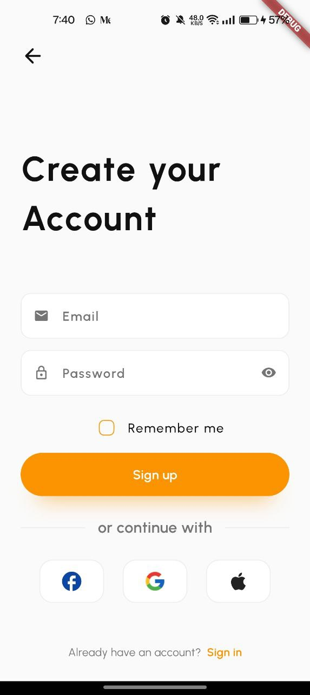

   <h1>Casca - Your Eye, Your Doorstep</h1>

### 💇 Overview
An Eye Vein Segmentation Model, made using the UNet pipeline for image segmentation to detect vascular vein patterns from a close-up eye image.

Built a mobile app in Flutter to display segmented outputs and enable user interaction with model predictions.

---

### 📷 Screenshots

|       |       |       |
|-----------------------------------------------|----------------------------------------------| ------------------------------------------- |
|  |  |  |

---

### 🌐 Acknowledgements

- All the users who believe in and support Casca.
- Special thanks to the design inspiration from our [Figma Design](https://www.figma.com/design/mc9H8nnbUFP8wG1LBjHVSf/Casca---Barber-%26-Salon-App-UI-Kit-(Preview)-(Copy)?m=auto&fuid=1211050345159188393).

### 📃 License

This project is licensed under the [MIT License](./LICENSE).

---

### 👨🏻‍💻 Connect with me

